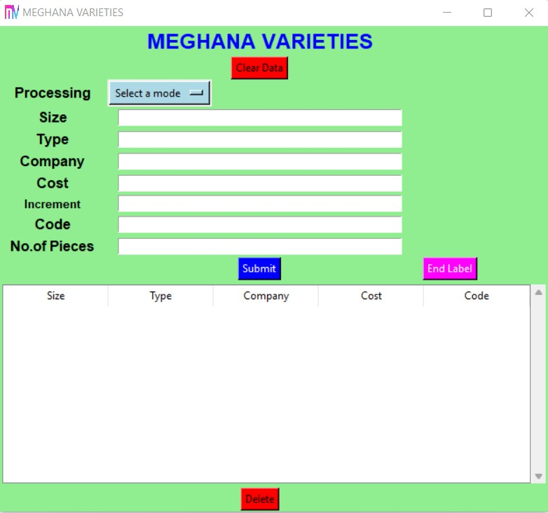
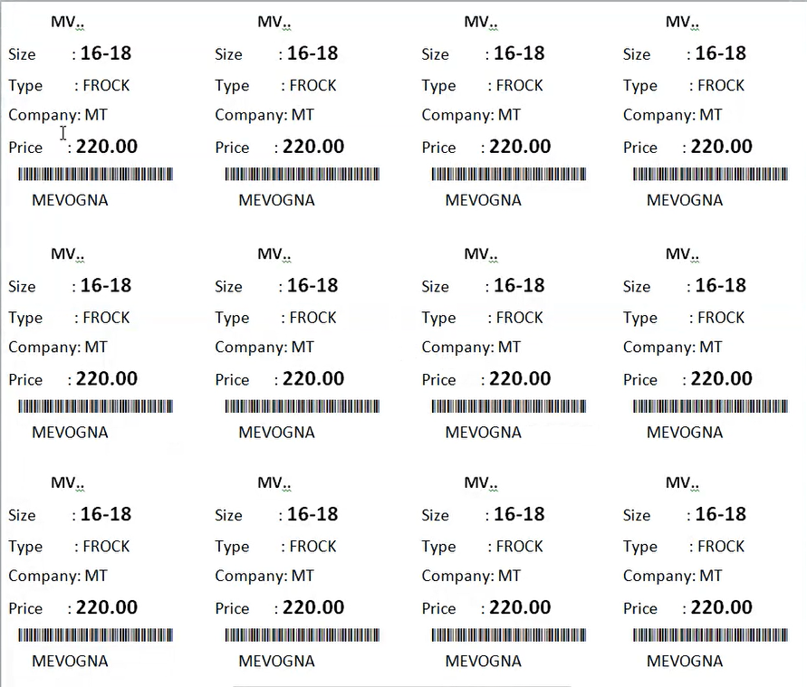

# Price-Tag-Label-Generation-for-Commercial-Use
Price Tag Label Generation application developed using Python, Tkinter and Openpyxl.
Price Tag Label are generated for commercial use using the Tkinter GUI. It is designed for making price labels for dresses. It takes size, type, company, price, code, cost, no.of pieces and generates price labels accordingly along the code 39 barcode containing the label data.

**Application:**

The data from the Tkinter GUI is written to the excel sheet and the data in the excel will be merged to the word document using the mail merge.

- Clean button is used to clear the data from the excel to enter the new data. All the changes will be made in the file "labels.xlsx" specified with its path and can be changed in the code to use any other.
- Processing can be done in three ways. First one is "Batch" which is meant to input range of sizes say 20X30 where it takes 20, 22, 24, ..., 30. Second one is "Single" where the user has to enter the one particular size say 32. Last one is "Series" which is meant to input range of sizes say 1X7 where it takes 1, 2, 3, ..., 7.
- Size needs to be entered in a format based on the processing type choosen.
- Type is bascially the item name.
- Company is the manufacturer of that product.
- Cost is the starting price if it is the batch/series proecessing or the cost of the particular product in single processing.
- Code can be secret language that represents the details of product, it comes below the barcode.
- Increment is given to add the cost increment for size in the range of the size given. Let's say if the starting cost for the range 20X30 is given 600 and increment is 10, then the cost for the size 20 is 600, size 22 is 610, size 24 is 620 and so on.
- Cost increment is given for the individual cost increment for the sizes in the range specified. (applicable only for batch and series processing)
- No.of Pieces takes the input the number of items. Let's say if the size is given as 20X30 and no.of pieces is 2 it takes as 20 two pieces, 22 two pieces and so on.
-  Submit button is to be pressed when the particular type of item is over within the range of 24 labels per sheet.
- End label button needs to be pressed when the entire 24 labels are filled or when the task is ended.

**Output:**

