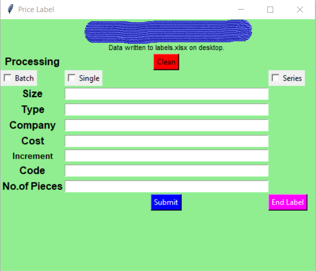

# Price-Tag-Label-Generation-for-Commercial-Use
Price Tag Label Generation application made using Python, Tkinter and Openpyxl.
Price Tag Label are generated for commercial use using the Tkinter GUI. It is designed for making price labels for dresses. It takes size, type, company, price, code, cost, no.of pieces and generates price labels accordingly along the code 39 barcode containing the label data.

**Application:**

The data from the Tkinter GUI is written to the excel sheet and the data in the excel will be merged to the word document using the mail merge.
